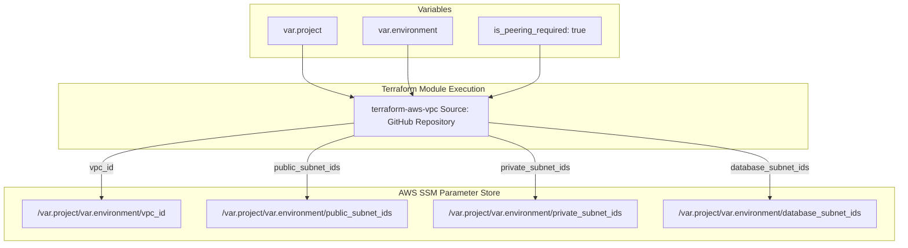

# Roboshop VPC Provisioning

This directory manages the foundational networking infrastructure (Virtual Private Cloud) for the Roboshop application. It acts as the very first step (`00-vpc`) in deploying the environment.

---

## 📖 Overview

Instead of hardcoding VPC configurations, this directory utilizes a pre-built custom Terraform module stored on GitHub. By calling this remote module, it provisions a highly available network architecture with public, private, and database subnets.

It also automatically saves the generated network IDs into the **AWS Systems Manager (SSM) Parameter Store**. This allows subsequent layers (like security groups, databases, and microservices) to easily fetch and attach to the correct subnets without manual intervention.

### Key Features
- **Remote Module Invocation**: Leverages a centralized GitHub module (`terraform-aws-vpc`) to ensure networking standards are maintained.
- **VPC Peering**: Enables `is_peering_required = true` to allow traffic routing between the newly created VPC and the default AWS VPC.
- **State Decoupling**: Uses SSM Parameters to export Subnet and VPC IDs, completely decoupling the networking state file from the application state files.

---

## 🏗️ Architecture Visualization

The following flowchart illustrates how the code passes inputs to the external module and captures the outputs into the Parameter Store:



---

## ⚙️ How It Works

1. **`main.tf`**: Calls the remote GitHub repository module, passing the Project Name (`roboshop`), Environment (`dev`), and Peering requirement.
2. **`outputs.tf`**: Extracts the generated network IDs from the remote module so they can be viewed in the terminal after a successful apply.
3. **`parameters.tf`**: Takes those exact same outputs and saves them securely into the AWS SSM Parameter Store as strings and string lists.
4. **`provider.tf`**: Sets up the AWS provider and configures the S3 backend for remote state storage.

---

## 🚀 How to Apply

Because this is the absolute base layer of the infrastructure, it **must** be applied before anything else.

```bash
# Initialize the directory and download the GitHub module
terraform init

# Review the network plan
terraform plan

# Provision the VPC and save parameters to SSM
terraform apply -auto-approve
```
