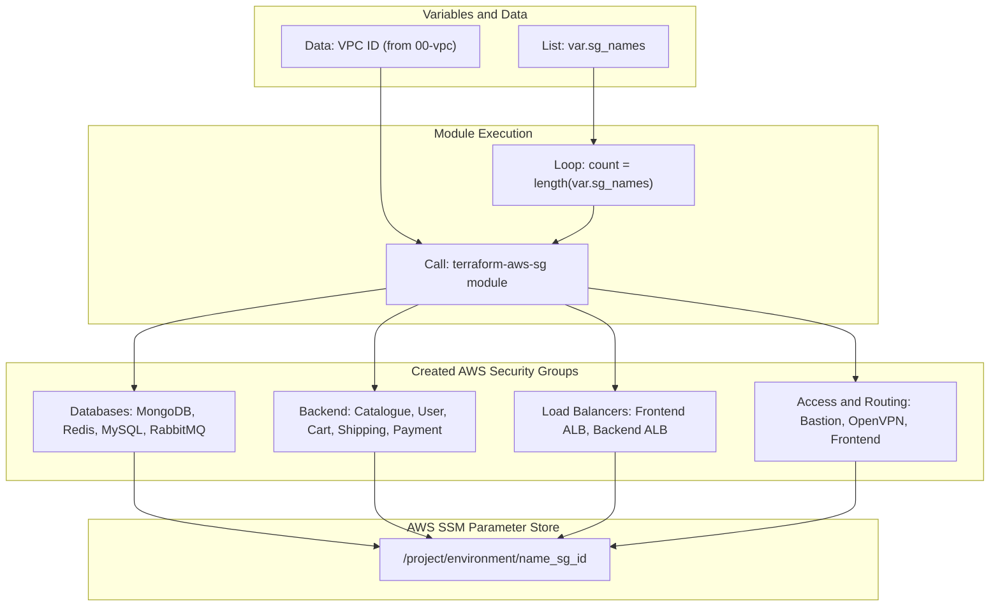

# Roboshop Security Groups Provisioning

This directory is responsible for batch-creating all the base Security Groups for the Roboshop microservices architecture. It acts as the second step (`10-sg`) in deploying the environment, immediately following the VPC creation.

---

## 📖 Overview

Instead of writing a separate `aws_security_group` block for all 14 different microservice components, this directory uses the power of Terraform's `count` loop. 

It passes a master list of component names into our custom `terraform-aws-sg` module. After the empty security groups are created, their IDs are individually exported directly into the **AWS Systems Manager (SSM) Parameter Store**.

### Key Features
- **DRY Code (Don't Repeat Yourself)**: Creates 14 unique Security Groups using only a 10-line `main.tf` file.
- **SSM Parameter Exporting**: Automatically registers the generated SG IDs into the Parameter Store (e.g., `/${project}/${environment}/mongodb_sg_id`). This makes them easily discoverable by the `20-sg-rules` and `90-components` layers without tightly coupling state files.
- **Data Lookup**: Fetches the `vpc_id` directly from the Parameter Store that was populated by the `00-vpc` layer.

---

## 🏗️ Architecture Visualization

> 💡 **Full Screen View**: Right-click the flow chart below and select **"Open image in new tab"** to view the diagram in full screen!



---

## ⚙️ How It Works

1. **`variables.tf`**: Defines a `list` variable containing the names of all 14 components required by the architecture (Databases, Backend Services, Frontend, ALBs, Bastion, and OpenVPN).
2. **`data.tf` & `locals.tf`**: Reaches into the AWS SSM Parameter Store to grab the `vpc_id` that was generated in the `00-vpc` phase.
3. **`main.tf`**: Loops through the list of 14 components using `count.index`, passing the name and the `vpc_id` to our custom SG module to spin up the actual AWS Security Groups.
4. **`parameters.tf`**: Performs a second loop over the outputted IDs, securely saving all 14 Security Group IDs back into the SSM Parameter Store.

---

## 🚀 How to Apply

Ensure that `00-vpc` has been applied successfully before running this code, as it depends on the VPC ID parameter!

```bash
# Initialize the directory and download the GitHub module
terraform init

# Review the Security Group loop plan
terraform plan

# Provision the 14 Security Groups and export parameters
terraform apply -auto-approve
```
