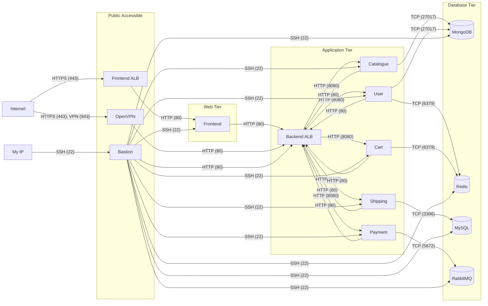

# Roboshop Security Group Rules

A Terraform module containing all Security Group Rules (Ingress) for the Roboshop microservices architecture. It connects all independent Security Groups created previously, forming a securely locked-down network architecture based on the Principle of Least Privilege.

---

## 📖 Overview

This directory provisions `aws_security_group_rule` resources to allow specific traffic flows between various components of the Roboshop application. 

Instead of hardcoding Security Group IDs or running everything in a single state file, it dynamically fetches the required SG IDs from the **AWS Systems Manager Parameter Store (SSM)**.

### Key Features
- **Zero Trust Network**: By default, no component can communicate with another until explicitly permitted here.
- **Dynamic IP Fetching**: The executor's public IP is dynamically fetched via the `icanhazip.com` API to allow Bastion SSH access exclusively from your current workstation.
- **Decoupled Architecture**: Security Groups (`10-sg`) and their Rules (`20-sg-rules`) are separated to prevent Terraform cyclical dependency errors.

---

## 🏗️ Architecture Visualization

The following diagram demonstrates the precise allowed traffic flows between the components:



---

## 🚦 Traffic Flow Details

### Public Access
- **Frontend ALB**: Accepts `HTTPS (443)` from the Internet (`0.0.0.0/0`).
- **OpenVPN**: Accepts `HTTPS (443)` and `TCP (943)` from the Internet (`0.0.0.0/0`).
- **Bastion**: Accepts `SSH (22)` strictly from the executor's current public IP address dynamically fetched during deployment.

### Application Flow
- **Frontend**: Accepts `HTTP (80)` from the Frontend ALB.
- **Backend ALB**: Acts as an internal router. Accepts `HTTP (80)` from the Frontend, OpenVPN, Bastion, and internally between all backend microservices.
- **Microservices** (`Catalogue`, `User`, `Cart`, `Shipping`, `Payment`): Accept `HTTP (8080)` requests routed via the Backend ALB.

### Database Access
- **MongoDB**: Accepts `TCP (27017)` from `Catalogue` and `User`.
- **Redis**: Accepts `TCP (6379)` from `User` and `Cart`.
- **MySQL**: Accepts `TCP (3306)` from `Shipping`.
- **RabbitMQ**: Accepts `TCP (5672)` from `Payment`.

### Maintenance & Debugging (Bastion)
The Bastion host has `SSH (22)` access to all internal EC2 instances (Frontend, Microservices, and Databases) for secure administrative access.

---

## 🛠️ Data Sources (`data.tf`)

This module extensively uses `data` blocks to read existing infrastructure context.
1. `data "http" "my_public_ip_v4"`: Calls `https://ipv4.icanhazip.com` to dynamically locate your IP address to whitelist it on the Bastion host.
2. `data "aws_ssm_parameter"`: Safely retrieves the various SG IDs that were generated by the prior `10-sg` terraform apply.

---

## 🚀 How to Apply

Because this code connects existing infrastructure, ensure the `10-sg` layer is applied first!

```bash
# Initialize Terraform
terraform init

# Review the Planned Rules
terraform plan

# Apply the Rules
terraform apply -auto-approve
```
