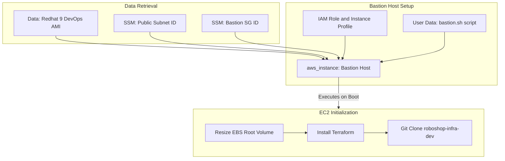

# Roboshop Bastion Host Provisioning

This directory is responsible for deploying the **Bastion Host** (also known as a Jump Box). The Bastion acts as the secure entry point into your AWS environment and serves as the primary control plane for deploying the rest of the infrastructure (like databases and microservices) using Terraform.

---

## 📖 Overview

The code in this directory provisions an EC2 instance in a public subnet, attaches the previously created Bastion Security Group, and assigns it an IAM role. 

Crucially, it uses an initialization script (`bastion.sh`) to automatically bootstrap the server. This script expands the disk space, installs Terraform, and downloads the infrastructure repository so that you can immediately SSH into the Bastion and continue deploying the backend components.

### Key Features
- **Secure Entry Point**: Deployed in a public subnet but secured by the Bastion Security Group (which is restricted to your specific IP via the `20-sg-rules` layer).
- **Automated Bootstrapping**: The `user_data` script ensures the Bastion is fully prepared for DevOps tasks immediately upon boot.
- **IAM Identity**: Attaches an IAM Instance Profile so the Bastion can securely execute Terraform commands against your AWS account without needing hardcoded access keys.

---

## 🏗️ Architecture Visualization

> 💡 **Full Screen View**: Right-click the flow chart below and select **"Open image in new tab"** to view the diagram in full screen!



---

## ⚙️ How It Works

1. **`data.tf`**: Automatically finds the latest Redhat-9-DevOps-Practice AMI. It also looks up the Public Subnet ID and the Bastion Security Group ID from the SSM Parameter Store.
2. **`main.tf`**: 
   - Provisions the `t3.micro` EC2 instance.
   - Increases the root EBS volume to 50GB.
   - Creates an IAM Role (`RoboShopDevBastion`) and attaches the `AdministratorAccess` policy to allow Terraform execution from within the Bastion. *(Note: In production environments, this should be scoped down to least-privilege).*
3. **`bastion.sh`**: The initialization script that runs on the first boot. It extends the logical volume to utilize the full 50GB, installs Terraform via the official HashiCorp repo, and clones this GitHub repository.

---

## 🚀 How to Apply

Make sure both `00-vpc` and `10-sg` have been successfully applied before running this, as the Bastion requires the VPC subnets and the Security Group.

```bash
# Initialize the directory
terraform init

# Review the Bastion host plan
terraform plan

# Provision the Bastion and IAM roles
terraform apply -auto-approve
```
