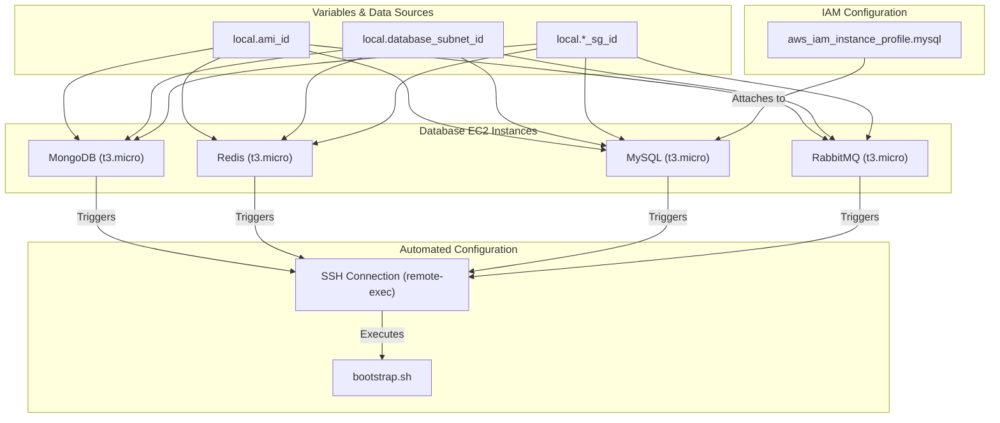

# 🗄️ 40-Databases

This layer is responsible for provisioning the stateful data storage systems required by the Roboshop application. It creates and bootstraps the backend database instances (MongoDB, Redis, MySQL, and RabbitMQ) inside the secure database subnets.

## 📋 Overview

The `40-databases` module performs the following key functions:
1. **Database Instances Provisioning**: Deploys four EC2 instances for the required databases using `t3.micro`.
2. **Secure Placement**: All databases are placed inside the private Database Subnets created in the `00-vpc` layer.
3. **Automated Bootstrapping**: Uses Terraform's `remote-exec` and `file` provisioners to copy and execute the `bootstrap.sh` script, which configures each database automatically on boot.
4. **IAM Configuration**: Creates and attaches an IAM instance profile specifically for MySQL to securely fetch credentials or parameters if needed.

## 🏗️ Architecture Visualization

The flowchart below visualizes the database provisioning flow, showing how SSM parameters (like Subnet IDs and Security Group IDs) are fetched, the instances are created, and the bootstrapping script is executed over SSH.



## 🔐 Security and Access
- **Zero Public Access**: Databases do not have public IPs and reside in private subnets.
- **Strict Security Groups**: They are associated with strict security groups created in the `10-sg` layer, with ingress rules managed in `20-sg-rules`.
- **Bootstrapping**: The initialization is done via an SSH connection using the default `ec2-user` and password, transferring the `bootstrap.sh` script dynamically.

## 🚀 Execution

To provision the databases:
```bash
cd 40-databases
terraform init
terraform apply -auto-approve
```
