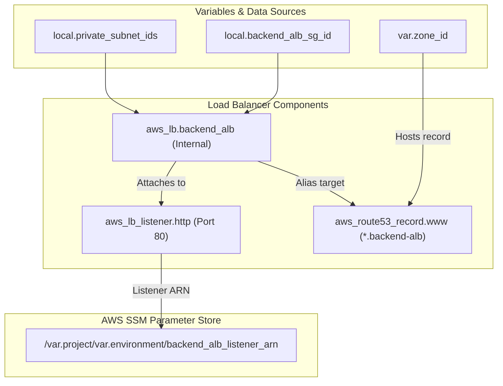

# ⚖️ 50-Backend-ALB

This layer provisions the **Internal Application Load Balancer (ALB)** for the backend microservices. The Backend ALB sits inside the private subnets and routes traffic from the frontend components to the appropriate backend microservices (like Catalogue, Cart, User, etc.).

## 📋 Overview

The `50-backend-alb` module performs the following functions:
1. **Internal ALB Creation**: Deploys an internal, non-public Application Load Balancer across the private subnets created in the `00-vpc` layer.
2. **HTTP Listener**: Configures a default HTTP listener on Port 80. If a request does not match any specific microservice routing rule, it returns a default fixed response (`"<h1>Hi, I am from HTTP Backend ALB"`).
3. **DNS Record**: Automatically creates a wildcard Route53 alias record (e.g., `*.backend-alb-dev.domain.com`) that points to the ALB, allowing backend services to securely communicate using clean DNS names.
4. **Parameter Export**: Exports the listener ARN to the SSM Parameter Store so subsequent microservice layers can attach their specific routing rules to it.

## 🏗️ Architecture Visualization

The flowchart below demonstrates how the ALB integrates into the VPC, listens to traffic, and registers its details in the AWS SSM Parameter Store.



## 🔐 Security and Access
- **Internal Traffic Only**: The load balancer is marked as `internal = true`, meaning it is not accessible from the public internet.
- **Security Group**: It utilizes the `backend_alb` security group, which dictates that it only accepts traffic from specific sources (e.g., the Frontend ALB or the Bastion host).

## 🚀 Execution

To provision the Backend ALB:
```bash
cd 50-backend-alb
terraform init
terraform apply -auto-approve
```
