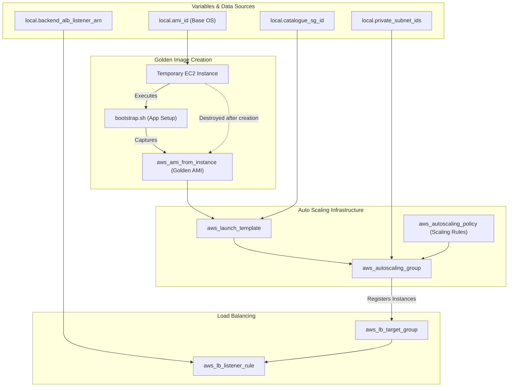

# 🏷️ 60-Catalogue

This layer is responsible for deploying the **Catalogue** microservice for the Roboshop application. It demonstrates an advanced, highly available, and auto-scaling infrastructure pattern using AWS Auto Scaling Groups (ASG), Launch Templates, and Application Load Balancer integration.

## 📋 Overview

The `60-catalogue` module performs the following critical functions:
1. **AMI Baking (Golden Image)**: Provisions a temporary EC2 instance, bootstraps the catalogue application using `bootstrap.sh`, and captures it as a custom Amazon Machine Image (AMI). The temporary instance is then destroyed.
2. **Launch Template**: Creates an AWS Launch Template using the generated Golden Image, ensuring that all future instances spin up fully configured.
3. **Auto Scaling Group (ASG)**: Deploys an ASG in the private subnets. The ASG manages the desired capacity, scaling out or in based on configured policies (e.g., CPU utilization).
4. **Load Balancer Integration**: Creates a Target Group and a Listener Rule to attach the Catalogue ASG instances to the Backend ALB created in the `50-backend-alb` layer, routing traffic based on the `catalogue` path or header.

## 🏗️ Architecture Visualization

The flowchart below visualizes the lifecycle of the Catalogue deployment, from Golden Image creation to Auto Scaling integration.



## 🔐 Security and Access
- **Private Subnet Placement**: All Catalogue instances spawned by the ASG are isolated within the private subnets.
- **Dynamic Port Mapping**: Instances only accept traffic from the Backend ALB security group, ensuring they cannot be bypassed.

## 🚀 Execution

To provision the Catalogue service:
```bash
cd 60-catalogue
terraform init
terraform apply -auto-approve
```
