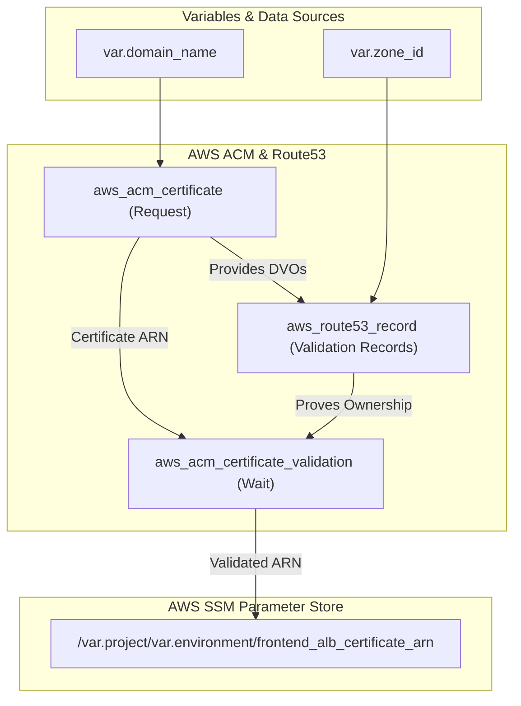

# 🔐 70-ACM (AWS Certificate Manager)

This layer provisions and automatically validates an SSL/TLS Certificate for the Roboshop application domain. Securing the domain with HTTPS is a critical step before deploying the public-facing Frontend Application Load Balancer.

## 📋 Overview

The `70-acm` module performs the following functions:
1. **Certificate Request**: Requests a wildcard SSL certificate (e.g., `*.roboshop.com`) from AWS Certificate Manager (ACM).
2. **DNS Validation**: Automatically extracts the required Domain Validation Options (DVOs) from the requested certificate and creates the necessary validation records in AWS Route53.
3. **Certificate Validation**: Tells Terraform to wait until AWS confirms that the DNS records are active and the certificate is fully validated.
4. **Parameter Export**: Exports the validated Certificate ARN to the SSM Parameter Store so it can be consumed by the Frontend ALB in the next layer.

## 🏗️ Architecture Visualization

The flowchart below visualizes the automated validation loop between ACM and Route53.



## 🔐 Security and Access
- **Lifecycle Rules**: The certificate is configured with `create_before_destroy = true`. This ensures zero-downtime certificate rotations in the future by bringing up the new certificate before deleting the old one.
- **Automated Validation**: Because validation uses DNS records in Route53, it removes the need for manual email validation, allowing for complete infrastructure automation.

## 🚀 Execution

To provision the ACM Certificate:
```bash
cd 70-acm
terraform init
terraform apply -auto-approve
```
