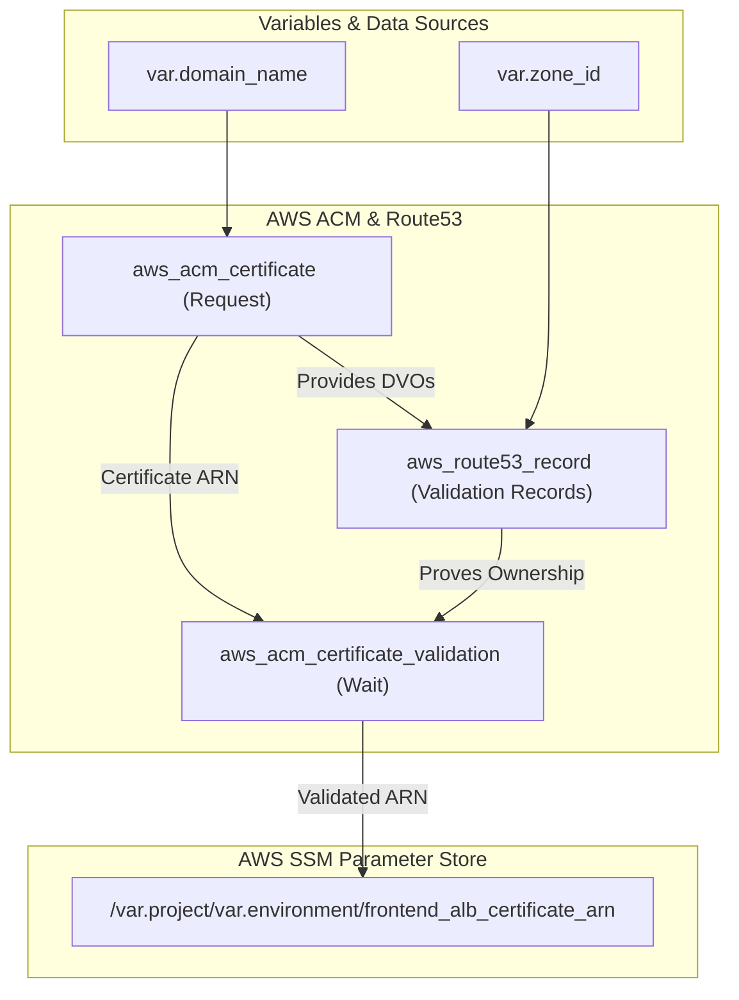

# 🔐 70-ACM (AWS Certificate Manager)

This layer provisions and automatically validates an SSL/TLS Certificate for the Roboshop application domain. Securing the domain with HTTPS is a critical step before deploying the public-facing Frontend Application Load Balancer.

## 📋 Overview

The `70-acm` module performs the following functions:
1. **Certificate Request**: Requests a wildcard SSL certificate (e.g., `*.roboshop.com`) from AWS Certificate Manager (ACM).
2. **DNS Validation**: Automatically extracts the required Domain Validation Options (DVOs) from the requested certificate and creates the necessary validation records in AWS Route53.
3. **Certificate Validation**: Tells Terraform to wait until AWS confirms that the DNS records are active and the certificate is fully validated.
4. **Parameter Export**: Exports the validated Certificate ARN to the SSM Parameter Store so it can be consumed by the Frontend ALB in the next layer.

## 🏗️ Architecture Visualization

The flowchart below visualizes the automated validation loop between ACM and Route53.



## 🔐 Security and Access
- **Lifecycle Rules**: The certificate is configured with `create_before_destroy = true`. This ensures zero-downtime certificate rotations in the future by bringing up the new certificate before deleting the old one.
- **Automated Validation**: Because validation uses DNS records in Route53, it removes the need for manual email validation, allowing for complete infrastructure automation.

## 🚀 Execution

To provision the ACM Certificate:
```bash
cd 70-acm
terraform init
terraform apply -auto-approve
```

---

## Troubleshooting / Quick‑Check Commands

The ACM layer is responsible for provisioning a **wildcard SSL/TLS certificate** and attaching it to the Frontend ALB. The commands below let you verify each step from a workstation that has AWS CLI access (e.g., the bastion host) and from a client that can reach the public endpoint.

### 1️⃣ Verify the certificate exists and is **ISSUED**
```bash
aws acm describe-certificate \
    --certificate-arn $(terraform output -raw frontend_alb_certificate_arn) \
    --query 'Certificate.{Arn:CertificateArn,Domain:DomainName,Status:Status,NotAfter:NotAfter}' \
    --output table
```
You should see `Status` = `ISSUED` and a future `NotAfter` date.

### 2️⃣ Check the DNS validation records are present
The ACM request creates one or more CNAME records that must resolve to the validation target. Replace `<domain>` with your base domain (e.g., `roboshop.com`).
```bash
# List the validation CNAMEs from the Terraform output (if exported) or from the ACM description
aws acm describe-certificate \
    --certificate-arn $(terraform output -raw frontend_alb_certificate_arn) \
    --query 'DomainValidationOptions[*].ResourceRecord.{Name:Name,Type:Type,Value:Value}' \
    --output json | jq -r '.[] | "dig +short \(.Name)"' | while read cmd; do eval $cmd; done
```
Each `dig` should return the CNAME target that ACM expects. If the result is empty, the Route53 validation record is missing or not propagated.

### 3️⃣ Verify the certificate is attached to the Frontend ALB listener
```bash
aws elbv2 describe-listeners \
    --load-balancer-arn $(terraform output -raw frontend_alb_arn) \
    --query 'Listeners[?Protocol==`HTTPS`].Certificates[*].CertificateArn' \
    --output text
```
The output should match the ARN you obtained in step 1.

### 4️⃣ End‑to‑end HTTPS health‑check of the public endpoint
Replace `frontend-alb-dev.example.com` with the actual DNS name exported by the Frontend‑ALB layer.
```bash
curl -s -o /dev/null -w "%{http_code}\n" https://frontend-alb-${var.environment}.${var.domain_name}/health
```
A `200` response indicates the ALB is serving traffic over TLS and the health‑check endpoint of the Frontend service is reachable.

### 5️⃣ Inspect the TLS certificate with OpenSSL (optional)
```bash
openssl s_client -connect frontend-alb-${var.environment}.${var.domain_name}:443 -servername frontend-alb-${var.environment}.${var.domain_name} </dev/null | \
    openssl x509 -noout -dates -subject -issuer
```
You should see the `notBefore`/`notAfter` dates and the correct `CN`/`SAN` (e.g., `*.example.com`).

### TL;DR
1. `aws acm describe-certificate …` – ensure **ISSUED**.  
2. `dig` the validation CNAMEs – they must resolve.  
3. `aws elbv2 describe-listeners …` – certificate ARN attached to the ALB.  
4. `curl https://…/health` – expect `200`.  
5. `openssl s_client …` – view certificate details.
