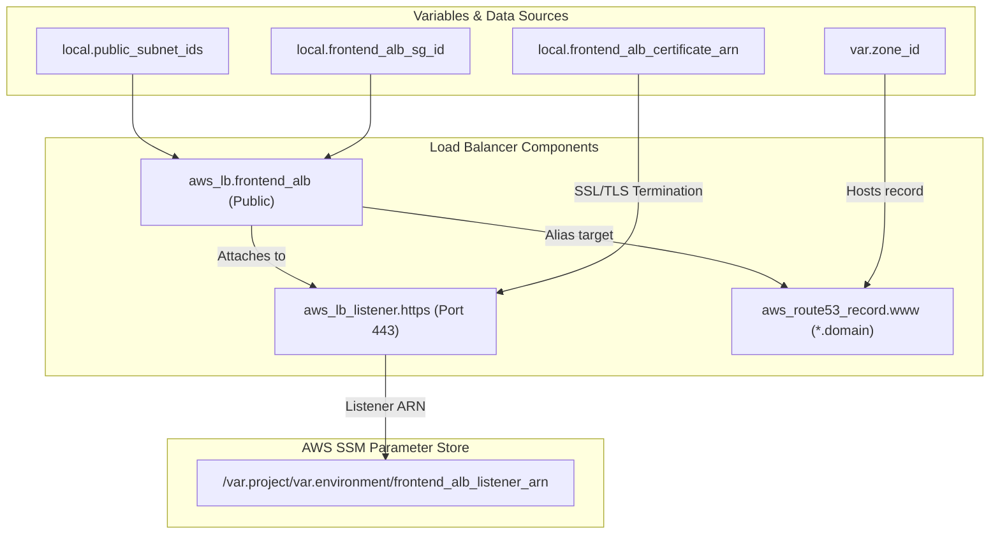

# 🌐 80-Frontend-ALB

This layer provisions the **Public Application Load Balancer (ALB)**, which acts as the main entry point for the Roboshop application from the public internet. It terminates SSL/TLS connections using the ACM certificate provisioned in the previous layer.

## 📋 Overview

The `80-frontend-alb` module performs the following critical functions:
1. **Public ALB Creation**: Deploys an internet-facing Application Load Balancer across the public subnets.
2. **HTTPS Listener Setup**: Configures a listener on Port 443 (HTTPS) to ensure all traffic to the application is securely encrypted. It binds the ACM Certificate (fetched from SSM) to this listener.
3. **DNS Record**: Automatically creates a wildcard Route53 alias record (e.g., `*.roboshop.com`) that points to the Frontend ALB, allowing public users to access the application via domain names.
4. **Parameter Export**: Exports the Frontend Listener ARN to the SSM Parameter Store so the Frontend Web application (in the `90-components` or `web` layer) can attach its target groups to it.

## 🏗️ Architecture Visualization

The flowchart below demonstrates how public traffic enters the VPC via the Frontend ALB and securely terminates SSL before routing.



## 🔐 Security and Access
- **Public Access**: The load balancer is marked as `internal = false`, making it accessible from the internet.
- **Security Group**: It utilizes the `frontend_alb` security group, which dictates that it only accepts HTTPS (443) and HTTP (80) traffic from anywhere (`0.0.0.0/0`).
- **Encryption**: Traffic is encrypted in transit up to the ALB, which acts as the SSL termination point, offloading decryption overhead from the actual frontend EC2 instances.

## 🚀 Execution

To provision the Frontend ALB:
```bash
cd 80-frontend-alb
terraform init
terraform apply -auto-approve
```
