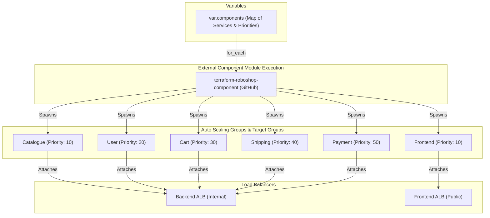

# 🧩 90-Components

This layer provisions the remaining **Microservices** (Catalogue, User, Cart, Shipping, Payment, and Frontend) for the Roboshop application. Instead of duplicating Terraform code for each microservice, this layer uses a dynamic `for_each` loop over an external shared module.

## 📋 Overview

The `90-components` module performs the following functions:
1. **Batch Microservice Provisioning**: Uses the `terraform-roboshop-component` module to provision multiple identical components efficiently.
2. **Dynamic Routing Setup**: Passes unique routing priorities for each component (e.g., `catalogue = 10`, `user = 20`) so that the Load Balancers know how to correctly route traffic paths to the correct Auto Scaling Groups.
3. **Frontend and Backend Separation**: The module handles both Backend components (which attach to the Backend ALB) and the Frontend component (which attaches to the Frontend ALB).

## 🏗️ Architecture Visualization

The flowchart below demonstrates how the single module dynamically provisions multiple distinct microservices and links them to the correct Load Balancer rules based on the provided variables.



## 🔐 Security and Access
- **Encapsulation**: Because it relies on the central module, all subnets and security group IDs are inherently configured correctly without duplicating manual inputs.
- **Rule Priorities**: Ensures that ALB Listener rules do not conflict. AWS ALBs process listener rules in order of priority, so ensuring no two services have the same priority is strictly enforced here.

## 🚀 Execution

To provision the microservices:
```bash
cd 90-components
terraform init
terraform apply -auto-approve
```
