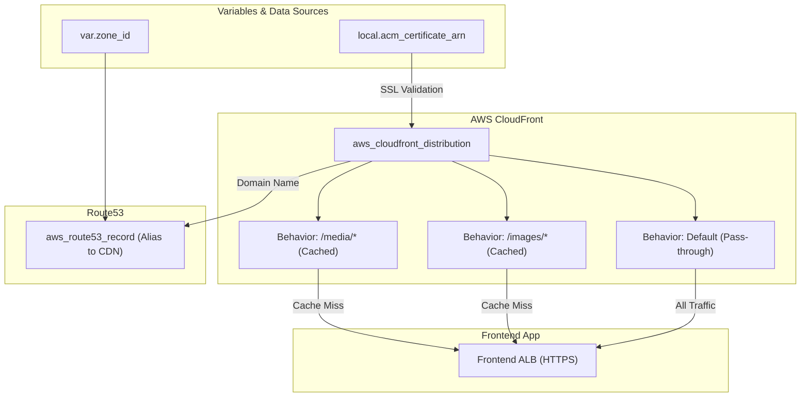

# ⚡ 95-CDN (CloudFront)

This layer configures an **AWS CloudFront Distribution** to act as a Content Delivery Network (CDN) for the Roboshop application. By caching static assets closer to the user, it significantly reduces latency and offloads traffic from the application servers.

## 📋 Overview

The `95-cdn` module performs the following critical functions:
1. **CloudFront Distribution**: Creates a globally distributed CDN that sits in front of the Roboshop Frontend Application.
2. **Origin Configuration**: Points the CDN to the Frontend Application Load Balancer (`frontend-dev.domain.com`) over strict HTTPS.
3. **Cache Behaviors**:
   - **Static Assets (`/images/*` and `/media/*`)**: Caching is enabled (`cachingOptimized`) so these assets are served directly from edge locations.
   - **Default/API Traffic**: Caching is disabled (`cachingDisabled`) for dynamic application data to ensure real-time accuracy and allow all HTTP methods (POST, PUT, DELETE, etc.) to pass through directly to the backend.
4. **SSL/TLS & DNS**: Attaches the previously generated ACM certificate to the CDN and creates a Route53 alias record (e.g., `roboshop-dev.domain.com`) pointing to the CloudFront distribution domain.

## 🏗️ Architecture Visualization

The flowchart below visualizes how traffic routes through the CDN before hitting the Frontend Application.



## 🔐 Security and Access
- **HTTPS Only**: Both Viewer Protocol and Origin Protocol policies are set to strictly enforce HTTPS, ensuring end-to-end encryption.
- **SNI Support**: Utilizes Server Name Indication (`sni-only`) to securely serve the custom domain certificate over CloudFront without incurring dedicated IP costs.

## 🚀 Execution

To provision the CDN:
```bash
cd 95-cdn
terraform init
terraform apply -auto-approve
```

---

## Troubleshooting / Quick‑Check Commands

The CDN layer creates an **AWS CloudFront distribution** with a Route53 alias (e.g. `roboshop-dev.example.com`). The commands below let you verify that the distribution is deployed, the DNS resolves correctly, and the caching behavior works as expected.

### 1️⃣ Verify the CloudFront distribution status
```bash
aws cloudfront list-distributions \
    --query "DistributionList.Items[?Comment=='${var.project}-${var.environment}-cdn'].{Id:Id,Domain:DomainName,Status:Status}" \
    --output table
```
The `Status` column should show `Deployed`. If it shows `InProgress`, wait a few minutes and re‑run.

### 2️⃣ Check the Route53 alias resolves to the CloudFront domain name
```bash
dig +short roboshop-${var.environment}.${var.domain_name}
```
The output should be the CloudFront domain (e.g. `d1234abcd.cloudfront.net`).

### 3️⃣ End‑to‑end request for a **static asset** (caching enabled)
Replace `/images/logo.png` with any known static file that exists in the origin.
```bash
curl -I -s https://roboshop-${var.environment}.${var.domain_name}/images/logo.png
```
Typical successful headers include:
```
HTTP/2 200 
Content-Type: image/png
Cache-Control: max‑age=31536000, public
X-Cache: Hit from cloudfront   # after the first request
```
If you see `Cache-Control: no‑cache` or a `404`, the origin path or cache behavior may be mis‑configured.

### 4️⃣ End‑to‑end request for a **dynamic endpoint** (caching disabled)
```bash
curl -I -s https://roboshop-${var.environment}.${var.domain_name}/api/health
```
You should see headers such as:
```
HTTP/2 200
Cache-Control: no‑cache, no‑store, must‑revalidate
X-Cache: Miss from cloudfront
```
If `Cache-Control` shows a long max‑age, the default cache behavior may need adjustment.

### 5️⃣ Inspect the distribution configuration (optional)
```bash
aws cloudfront get-distribution-config \
    --id $(aws cloudfront list-distributions --query "DistributionList.Items[?Comment=='${var.project}-${var.environment}-cdn'].Id" --output text) \
    --query 'DistributionConfig.{Origins:Origins.Items,CacheBehaviors:CacheBehaviors.Items}'
```
This prints the origin URLs and cache‑behavior settings so you can verify paths, TTLs, and allowed HTTP methods.

### TL;DR
1. `aws cloudfront list‑distributions …` – ensure **Deployed**.  
2. `dig +short <cdn‑alias>` – resolves to CloudFront domain.  
3. `curl -I https://<cdn‑alias>/images/...` – expect `Cache‑Control: max‑age` and `X‑Cache: Hit`.  
4. `curl -I https://<cdn‑alias>/api/health` – expect `Cache‑Control: no‑cache`.  
5. `aws cloudfront get‑distribution‑config …` – view detailed config if needed.
> **Note**: CloudFront distributions typically take 5 to 15 minutes to fully deploy across all global edge locations.
