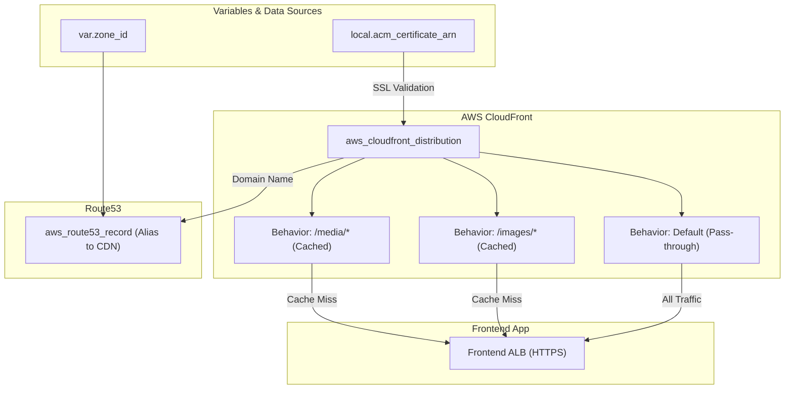

# ⚡ 95-CDN (CloudFront)

This layer configures an **AWS CloudFront Distribution** to act as a Content Delivery Network (CDN) for the Roboshop application. By caching static assets closer to the user, it significantly reduces latency and offloads traffic from the application servers.

## 📋 Overview

The `95-cdn` module performs the following critical functions:
1. **CloudFront Distribution**: Creates a globally distributed CDN that sits in front of the Roboshop Frontend Application.
2. **Origin Configuration**: Points the CDN to the Frontend Application Load Balancer (`frontend-dev.domain.com`) over strict HTTPS.
3. **Cache Behaviors**:
   - **Static Assets (`/images/*` and `/media/*`)**: Caching is enabled (`cachingOptimized`) so these assets are served directly from edge locations.
   - **Default/API Traffic**: Caching is disabled (`cachingDisabled`) for dynamic application data to ensure real-time accuracy and allow all HTTP methods (POST, PUT, DELETE, etc.) to pass through directly to the backend.
4. **SSL/TLS & DNS**: Attaches the previously generated ACM certificate to the CDN and creates a Route53 alias record (e.g., `roboshop-dev.domain.com`) pointing to the CloudFront distribution domain.

## 🏗️ Architecture Visualization

The flowchart below visualizes how traffic routes through the CDN before hitting the Frontend Application.



## 🔐 Security and Access
- **HTTPS Only**: Both Viewer Protocol and Origin Protocol policies are set to strictly enforce HTTPS, ensuring end-to-end encryption.
- **SNI Support**: Utilizes Server Name Indication (`sni-only`) to securely serve the custom domain certificate over CloudFront without incurring dedicated IP costs.

## 🚀 Execution

To provision the CDN:
```bash
cd 95-cdn
terraform init
terraform apply -auto-approve
```
> **Note**: CloudFront distributions typically take 5 to 15 minutes to fully deploy across all global edge locations.
