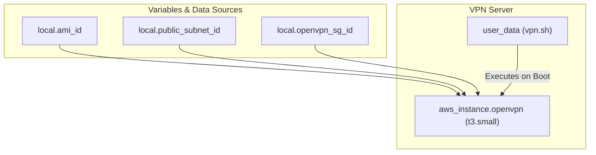

# 🛡️ 98-OpenVPN

This layer provisions an **OpenVPN Access Server**, providing secure, encrypted remote access to the internal network. Engineers and administrators can use this VPN to connect securely to the private subnets without exposing backend infrastructure directly to the public internet.

## 📋 Overview

The `98-openvpn` module performs the following functions:
1. **VPN Instance**: Deploys a `t3.small` EC2 instance in the public subnet to act as the VPN gateway.
2. **Automated Setup**: Executes the `vpn.sh` script via EC2 `user_data` at boot time to automatically install and configure the OpenVPN service.
3. **Secure Networking**: Attaches the instance to the `openvpn` security group, which manages inbound connections (typically UDP 1194 or TCP 443 for VPN traffic).

## 🏗️ Architecture Visualization

The flowchart below demonstrates the deployment of the OpenVPN instance into the public subnet and its bootstrapping process.



## 🔐 Security and Access
- **Encrypted Access**: By connecting through this OpenVPN server, administrators gain secure access to the private subnets (e.g., to query Databases or connect to the Bastion host securely).
- **Public Subnet Placement**: The VPN server is placed in the public subnet so users can reach it from the internet, but all traffic entering the VPC is strictly tunnelled.

## 🚀 Execution

To provision the OpenVPN server:
```bash
cd 98-openvpn
terraform init
terraform apply -auto-approve
```
