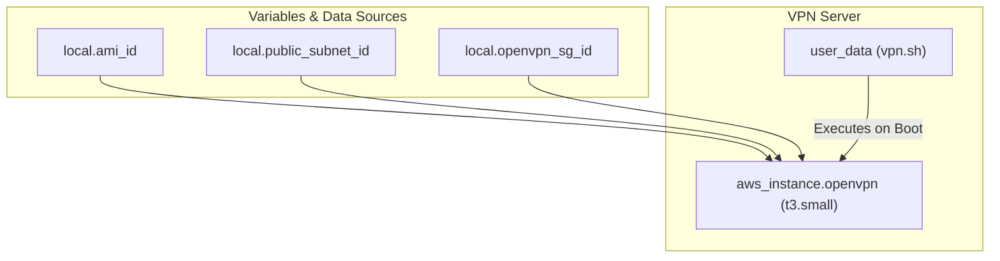

# 🛡️ 98-OpenVPN

This layer provisions an **OpenVPN Access Server**, providing secure, encrypted remote access to the internal network. Engineers and administrators can use this VPN to connect securely to the private subnets without exposing backend infrastructure directly to the public internet.

## 📋 Overview

The `98-openvpn` module performs the following functions:
1. **VPN Instance**: Deploys a `t3.small` EC2 instance in the public subnet to act as the VPN gateway.
2. **Automated Setup**: Executes the `vpn.sh` script via EC2 `user_data` at boot time to automatically install and configure the OpenVPN service.
3. **Secure Networking**: Attaches the instance to the `openvpn` security group, which manages inbound connections (typically UDP 1194 or TCP 443 for VPN traffic).

## 🏗️ Architecture Visualization

The flowchart below demonstrates the deployment of the OpenVPN instance into the public subnet and its bootstrapping process.



## 🔐 Security and Access
- **Encrypted Access**: By connecting through this OpenVPN server, administrators gain secure access to the private subnets (e.g., to query Databases or connect to the Bastion host securely).
- **Public Subnet Placement**: The VPN server is placed in the public subnet so users can reach it from the internet, but all traffic entering the VPC is strictly tunnelled.

## 🚀 Execution

To provision the OpenVPN server:
```bash
cd 98-openvpn
terraform init
terraform apply -auto-approve
```

---

## Troubleshooting / Quick‑Check Commands

The OpenVPN Access Server runs on a public EC2 instance. Use the following commands (run from a workstation that has AWS CLI access and SSH keys) to verify that the VPN server is reachable and the OpenVPN service is healthy.

### 1️⃣ Verify the instance is reachable via SSH
```bash
IP=$(terraform output -raw openvpn_public_ip)
ssh ec2-user@$IP "echo 'SSH connection OK'"
```
If you see `SSH connection OK`, the instance is reachable on port 22.

### 2️⃣ Check that the OpenVPN daemon is listening on the expected ports (UDP 1194 and optional TCP 443)
```bash
ssh ec2-user@$IP "netstat -tulnp | grep -E ':1194|:443'"
```
Typical output:
```
udp        0      0 0.0.0.0:1194          0.0.0.0:*                           1234/openvpn
tcp        0      0 0.0.0.0:443          0.0.0.0:*               LISTEN      1234/openvpn
```

### 3️⃣ Verify the OpenVPN service status via systemd
```bash
ssh ec2-user@$IP "sudo systemctl status openvpn-server@server.service"
```
If the unit name differs (e.g., `openvpn.service`), adjust the command accordingly. A healthy service shows `Active: active (running)`.

### 4️⃣ Test the OpenVPN web‑admin UI (HTTPS on port 443)
```bash
curl -k -I https://$IP/
```
You should receive a `200 OK` response with headers indicating the OpenVPN Access Server UI.

### 5️⃣ One‑liner health‑check for the VPN server
```bash
IP=$(terraform output -raw openvpn_public_ip)
echo "=== SSH ===" && ssh ec2-user@$IP "echo ok" && \
echo "=== Ports ===" && ssh ec2-user@$IP "netstat -tulnp | grep -E ':1194|:443'" && \
echo "=== Systemd ===" && ssh ec2-user@$IP "sudo systemctl is-active openvpn-server@server.service" && \
echo "=== UI ===" && curl -k -s -o /dev/null -w "%{http_code}\n" https://$IP/
```
The script prints `ok` for SSH, shows the listening sockets, confirms the service is `active`, and finally returns `200` for the UI.

---

## TL;DR

1. **SSH test** – `ssh ec2-user@<public‑ip> "echo OK"`  
2. **Port check** – `netstat -tulnp | grep -E ':1194|:443'` on the instance.  
3. **Systemd** – `sudo systemctl status openvpn-server@server.service`.  
4. **Web UI** – `curl -k -I https://<public‑ip>/` (expect `200`).  
5. **One‑liner** – combines all the above into a quick health‑check.
