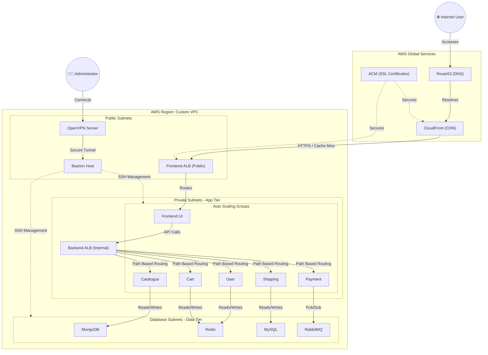

# 🚀 Roboshop Infrastructure Development

Welcome to the **Roboshop Infrastructure Repository**. This project contains a fully automated, production-grade AWS infrastructure deployment for a microservices-based e-commerce application (Roboshop). 

It is designed using **Terraform** and heavily relies on modular, decoupled, and secure infrastructure-as-code (IaC) principles. The entire architecture is broken down into distinct, numbered layers to prevent dependency cycles and allow for seamless state management.

---

## 🏛️ Master Architecture Overview

The architecture implements a highly available **3-Tier Network Topology** inside a custom VPC. 
- **Public Tier**: Hosts internet-facing Load Balancers, Bastion hosts, and VPN entry points.
- **App Tier (Private)**: Hosts the Auto Scaling Groups (ASGs) for all business logic microservices.
- **Data Tier (Private)**: Deeply secured subnets hosting stateful data stores.

### 🗺️ Full Infrastructure Flowchart



---

## 📂 Infrastructure Layers (Execution Order)

To guarantee that dependencies (like VPC IDs, Subnet IDs, and SSM Parameters) exist before they are called, the infrastructure must be deployed in the following specific numbered order:

| Order | Layer Directory | Purpose |
| :--- | :--- | :--- |
| **1** | `00-vpc` | Provisions the foundational network (VPC, IGW, NAT Gateways, Route Tables) and exports IDs to SSM. |
| **2** | `10-sg` | Batch-creates empty Security Groups for every component (Databases, ALBs, Apps) to act as logical containers. |
| **3** | `20-sg-rules` | Establishes the **Zero-Trust** network by wiring specific explicit ingress/egress rules between the Security Groups. |
| **4** | `30-bastion` | Deploys a jump host in the public subnet for secure SSH access into the private infrastructure. |
| **5** | `40-databases` | Deploys stateful DB instances (MySQL, MongoDB, Redis, RabbitMQ) into the secure database subnets. |
| **6** | `50-backend-alb` | Sets up the Internal Application Load Balancer to route traffic among the backend microservices. |
| **7** | `60-catalogue` | Demonstrates the Golden AMI pattern: Bakes the Catalogue app into an AMI and deploys it via an Auto Scaling Group. |
| **8** | `70-acm` | Generates and validates an SSL/TLS Wildcard Certificate via AWS Certificate Manager and Route53 DNS. |
| **9** | `80-frontend-alb` | Sets up the Public HTTPS Load Balancer with SSL termination using the ACM certificate. |
| **10** | `90-components` | Dynamically provisions the remaining apps (Cart, User, Shipping, Payment, Frontend) using a shared generic component module. |
| **11** | `95-cdn` | Configures an AWS CloudFront distribution for high-speed edge caching of images and media. |
| **12** | `98-openvpn` | Deploys a dedicated OpenVPN access server for secure administrative tunneling into the VPC. |

---

## 🛠️ Key Design Patterns

### 1. Decoupled State & SSM Global Registry
Instead of passing outputs directly between states (which leads to complex state dependencies and locking), this project uses **AWS Systems Manager (SSM) Parameter Store** as a global registry. 
- A foundational layer (like `00-vpc`) creates a resource and saves its ID to SSM (`/roboshop/dev/vpc_id`). 
- A downstream layer (like `50-backend-alb`) fetches that ID dynamically using `data "aws_ssm_parameter"`. 
- **Benefit**: Layers can be destroyed, recreated, and developed entirely independently of one another.

### 2. Zero-Trust Security Groups
Security groups are split into two layers (`10-sg` and `20-sg-rules`). By creating empty security groups first, we can create complex, circular ingress rules (e.g., App A allows App B, and App B allows App A) without causing Terraform dependency cycle errors.

### 3. Automated Bootstrapping & Golden AMIs
Instead of manually installing software, instances utilize `user_data`, `remote-exec`, and `file` provisioners to automatically bootstrap dependencies via `bootstrap.sh` on startup. The `60-catalogue` layer takes this a step further by demonstrating how to bake a "Golden Image" for high-performance Auto Scaling.

---

## 🚀 How to Deploy and Destroy

Because this infrastructure is highly decoupled but dependent on state parameters (like SSM), **the order of execution is strictly enforced.**

### 🏗️ Creating Infrastructure (Start to End)
When building the infrastructure, you must proceed in **ascending numerical order**, starting from `00-vpc` all the way to `98-openvpn`. This ensures that foundational resources (like VPCs and Security Groups) exist before applications try to attach to them.

```bash
# Example: Deploying the VPC layer first
cd 00-vpc
terraform init
terraform apply -auto-approve

# Proceed to the next layer sequentially...
cd ../10-sg
terraform init
terraform apply -auto-approve
```

> **Warning**: Never skip a layer during creation. For example, deploying `50-backend-alb` before `00-vpc` will fail because the required subnet SSM parameters will not exist yet.

### 🧨 Destroying Infrastructure (End to Start)
When tearing down the infrastructure, you **MUST** proceed in **reverse numerical order**, starting from `98-openvpn` all the way down to `00-vpc`. If you try to destroy `00-vpc` first, AWS will block the deletion because resources (like ALBs and EC2 instances) are still using those subnets.

```bash
# Example: Destroying the outermost layer first
cd 98-openvpn
terraform destroy -auto-approve

# Proceed backward through the layers...
cd ../95-cdn
terraform destroy -auto-approve

# ... continue until reaching 00-vpc
```
